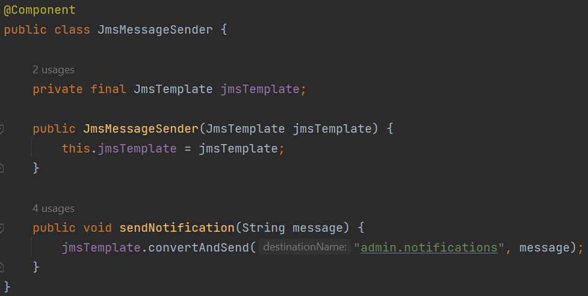

## Практическая работа №7
Устинов Данил КИ21-16/1Б

Создайте новую базу данных и пользователя в консоли psql под своими данными:
````
CREATE DATABASE rkis;
CREATE USER postgres WITH PASSWORD 'postgres';
\q
psql -h localhost -p 5432 -d rkis -U postgres -W
````
Введите пароль: postgres
````
\c rkis;
CREATE TABLE glasses (
id SERIAL PRIMARY KEY,
diopters DOUBLE PRECISION NOT NULL,
length_arches DOUBLE PRECISION NOT NULL,
lens_color TEXT NOT NULL,
frame_color TEXT NOT NULL,
brand TEXT NOT NULL
);
````

Для компиляции и запуска проекта нужно ввести в терминале, находясь в корневой папке:
````
mvn clean package
java -jar target/rkis7-1.0-SNAPSHOT.jar
````

Переделывалась 5 практическая работа
Примеры использования REST контроллера будут выведены в консоль после запуска приложения. Так же их можно посмотреть на рисунке ниже.


Вывод соответсвует тестам на рисунке ниже. Сами тесты находятся в классе RentClient, а REST контроллер - в классе RestMainController.

