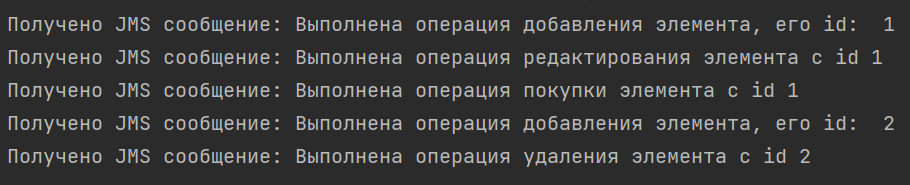

## Практическая работа №8
Устинов Данил КИ21-16/1Б

Создайте новую базу данных и пользователя в консоли psql под своими данными:
````
CREATE DATABASE rkis;
CREATE USER postgres WITH PASSWORD 'postgres';
\q
psql -h localhost -p 5432 -d rkis -U postgres -W
````
Введите пароль: postgres
````
\c rkis;
CREATE TABLE glasses (
id SERIAL PRIMARY KEY,
diopters DOUBLE PRECISION NOT NULL,
length_arches DOUBLE PRECISION NOT NULL,
lens_color TEXT NOT NULL,
frame_color TEXT NOT NULL,
brand TEXT NOT NULL,
purchased BOOLEAN NOT NULL DEFAULT false
);
````
Затем запустите в отдельном терминале:
````
activemq start
````

Для компиляции и запуска проекта нужно ввести в терминале, находясь в корневой папке:
````
mvn clean package
java -jar target/rkis8-1.0-SNAPSHOT.jar
````
Для работы с приложением откройте страницу в браузере:
````
http://localhost:8081/
````
Переделывалась 5 практическая работа.
Извлечение административных сообщений о выполненных операциях осуществляется в консоль. Так же их можно посмотреть на рисунке ниже.



Класс для приёма административных сообщений и перехвата этих сообщений для вывода в консоль представлен на рисунках ниже.


Купленные товары не отображаются при дальнейшем использовании приложения, их столбец purchased отмечен как true.